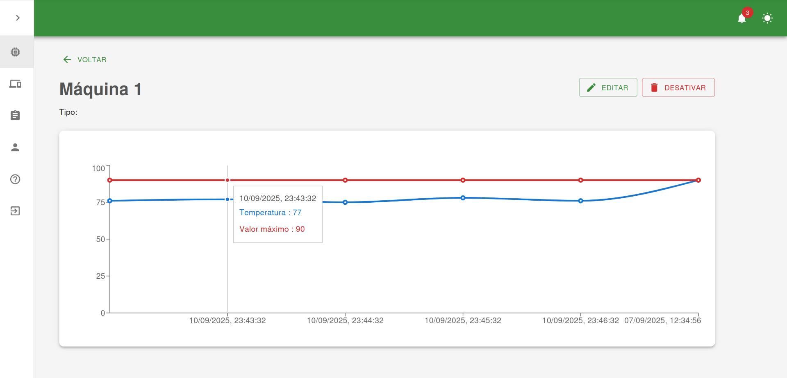
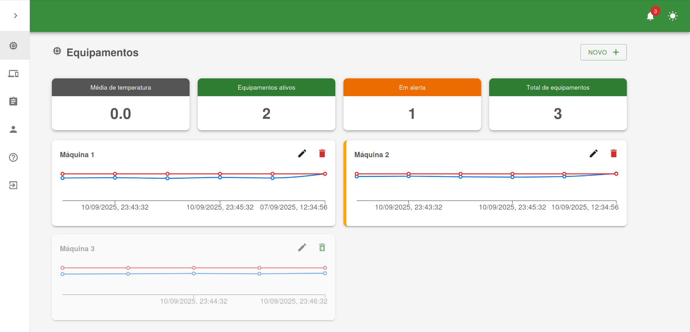

# Sistema de Análise de Qualidade de Máquinas

[🇧🇷 Português](#pt) | [🇬🇧 English](#en)

---
## Resumo

Projeto extracurricular de 1 ano e 3 meses no IFSul focado em análise e monitoramento da qualidade de máquinas industriais.  
Participei integrando **React e Spring Boot**, conectando **sensores via MQTT** para dashboards em tempo real, e iniciando estudos em **Machine Learning** para análise preditiva futura. O frontend foi estruturado de forma modular em React, com componentes reutilizáveis e comunicação com a API via Fetch. O backend e frontend são containerizados com Docker, permitindo ambientes consistentes e integração simplificada usando Docker Compose.

## Summary

1-year-and-3-month extracurricular project at IFSul focused on analyzing and monitoring the quality of industrial machines.  
I contributed by integrating **React and Spring Boot**, connecting **sensors via MQTT** for real-time dashboards, and initiating **Machine Learning** studies for future predictive analysis. The frontend was modularly structured in React with reusable components and API communication via Fetch.  
Backend and frontend are containerized with Docker, enabling consistent environments and simplified integration using Docker Compose.

## Sumário

- [🇧🇷 Português](#pt)
  - [Contexto do Projeto](#contexto-do-projeto)
  - [Tecnologias Utilizadas](#tecnologias-utilizadas)
  - [Funcionalidades em Desenvolvimento](#funcionalidades-em-desenvolvimento)
  - [Imagens do Sistema](#imagens-do-sistema)
- [🇬🇧 English](#en)
  - [Project Context](#project-context)
  - [Technologies Used](#technologies-used)
  - [Features in Development](#features-in-development)
  - [System Screenshots](#system-screenshots)

---

## 🇧🇷 Português

### Contexto do Projeto 

Durante minha graduação em Análise e Desenvolvimento de Sistemas no IFSul, participei de um projeto extracurricular de 1 ano e 3 meses, focado na análise e monitoramento da qualidade de máquinas industriais.  
Foi meu primeiro contato prático com **React e Spring Boot**, com suporte do IFSul por meio de cursos e orientação durante o desenvolvimento. Trabalhei na integração de **sensores via MQTT** para receber dados em tempo real, contribuindo para a criação de dashboards interativos que permitem acompanhamento instantâneo da situação das máquinas.  

A evolução do projeto ocorreu em etapas:
- **Primeiros meses:** cursos e familiarização com a stack de tecnologias;  
- **Meses seguintes:** prototipação e validação das telas, desenvolvimento e integração à API em React;  
- **Últimos meses:** integração do MQTT, atualização automática dos gráficos e início dos estudos de **Machine Learning**.  
  Iniciamos testes com algoritmos simples como **Random Forest** e **SVM** para análise preditiva, que serão aplicados futuramente em produção.

O projeto me desafiou a atuar em backend, frontend e integração de mensageria, aprofundando conhecimentos em **Indústria 4.0**, metodologias ágeis e tecnologias como React, Spring Boot e Docker.

### Tecnologias Utilizadas 

- **Front-end:** React.js (interfaces responsivas e dinâmicas)  
- **Back-end:** Java com Spring Boot (APIs REST)
- **Mensageria:** MQTT para recebimento de dados de sensores em tempo real
- **DevOps:** Docker para ambientes consistentes e portáveis  
- **Gerenciamento Ágil:** Kanban e Sprints, utilizando Trello para organização e acompanhamento das tarefas  
- **UX/UI:** Prototipação de telas e validação de fluxos com Figma, com feedback de professores e usuários

### Funcionalidades em Desenvolvimento 

- Interfaces responsivas para visualização e análise de dados  
- Integração robusta com APIs REST para comunicação entre front-end e back-end  
- Monitoramento de métricas e indicadores de qualidade  
- Criação de gráficos para análise visual da situação da máquina  
- Notificações ao usuário sobre atualizações relevantes

### Imagens do Sistema 

  
*Visualização da máquina monitorada.*

  
*Dashboard com gráficos e indicadores de qualidade das máquinas.*

---

## 🇬🇧 English

### Project Context 

During my studies as a Technologist in Systems Analysis and Development at IFSul, I participated in a 1-year-and-3-month extracurricular project focused on analyzing and monitoring the quality of industrial machines.  
It was my first practical experience with **React and Spring Boot**, with support from IFSul through courses and guidance during development. I worked on integrating **sensors via MQTT** to receive real-time data, contributing to the creation of interactive dashboards that enable instant monitoring of machine status.  

The project evolved in phases:
- **First months:** courses and familiarization with the technology stack;  
- **Following months:** prototyping and validation of screens, development and integration with the React API;  
- **Final months:** MQTT integration, automatic dashboard updates, and initial **Machine Learning** studies for future predictive analysis.  
  We started testing simple algorithms such as **Random Forest** and **SVM** for predictive analysis, which will be applied in production in the future.

The project challenged me to work on backend, frontend, and messaging integration, deepening my knowledge in **Industry 4.0**, agile methodologies, and technologies such as React, Spring Boot, and Docker.

### Technologies Used 

- **Front-end:** React.js (responsive and dynamic interfaces)  
- **Back-end:** Java with Spring Boot (REST APIs)
- **Asynchronous messaging:** MQTT for real-time sensor data
- **DevOps:** Docker containerization for consistent and portable environments  
- **Agile Management:** Kanban and Sprints, using Trello for task organization and tracking  
- **UX/UI:** Screen prototyping and flow validation with Figma, with feedback from professors and users

### Features in Development 

- Responsive interfaces for data visualization and analysis  
- Robust integration with REST APIs for front-end/back-end communication  
- Monitoring of quality metrics and indicators  
- Graph creation for visual analysis of machine status  
- User notifications about relevant updates

### System Screenshots 

  
*View of machine monitored.*

  
*Dashboard with machine quality graphs and indicators.*

---

**Contact:** Giovanna Dequi – Web Developer in training
